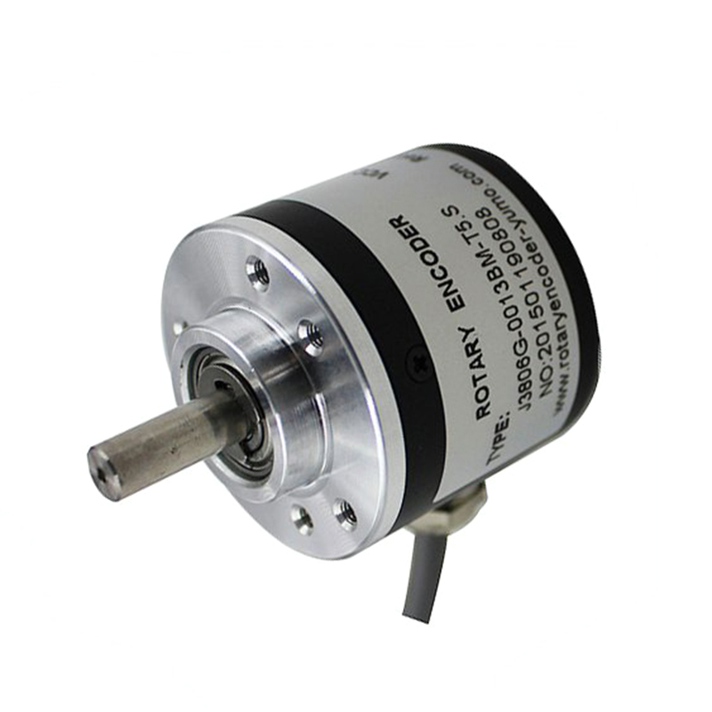
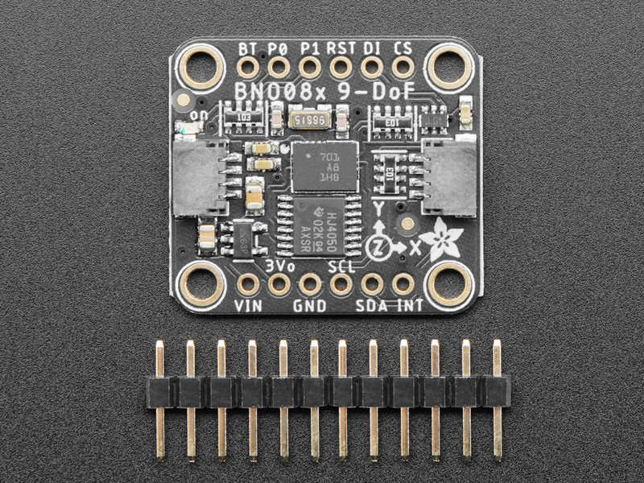
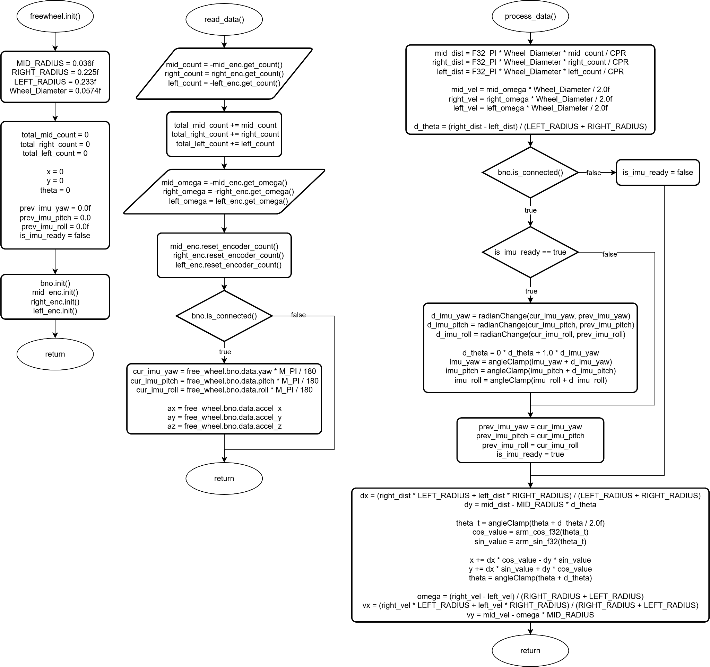

# Freewheel

STM32F103C8T6 firmware for odometry calculation using three wheels (one mid wheel and two side wheels) equipped with rotary encoders and an IMU sensor (BNO085). It  receives orientation and accelerations from IMU i.e. BNO085 in UART-RCV format. It uses its timer in encoder mode to receive counts from the freewheel encoders and computes the odometry


## Sensors

### Rotatary Encoder



### BNO08x




## Algorithm

Simple mathematics is used to compute odometry. The most important is the 2D rotation. Also sectional formula and complementary filter are used. Two freewheels are placed parallel to the forward direction and one freewheel perpendicular to the two freewheels. Yaw value from IMU is fused with yaw value from freewheels. In case the IMU is not connected, it uses only freewheels without any major problem, even when disconnected while running.




Watch this video to oderstand: [https://www.youtube.com/watch?v=ixsxDn_ddLE](https://www.youtube.com/watch?v=ixsxDn_ddLE)


## UART Data Packet/Frame Format

The STM32F103C8 transmits data via UART at **100 Hz (10ms period)** in the following binary format:

**Total Packet Size: 50 bytes**

### Byte-by-Byte Breakdown

| Byte(s) | Field | Type | Size | Description |
|---------|-------|------|------|-------------|
| 0 | START_BYTE | uint8_t | 1 | Packet delimiter: `0xA5` |
| **1-4** | **pose.x** | float32_t | 4 | X-coordinate (meters) |
| **5-8** | **pose.y** | float32_t | 4 | Y-coordinate (meters) |
| **9-12** | **pose.theta** | float32_t | 4 | Orientation angle (radians, range: [-π, π]) |
| **13-16** | **twist.vx** | float32_t | 4 | Linear velocity X (m/s) |
| **17-20** | **twist.vy** | float32_t | 4 | Linear velocity Y (m/s) |
| **21-24** | **twist.w** | float32_t | 4 | Angular velocity (rad/s) |
| **25-28** | **imu.yaw** | float32_t | 4 | IMU yaw angle (radians) |
| **29-32** | **imu.pitch** | float32_t | 4 | IMU pitch angle (radians) |
| **33-36** | **imu.roll** | float32_t | 4 | IMU roll angle (radians) |
| **37-40** | **imu.accel_x** | float32_t | 4 | Acceleration X (m/s²) |
| **41-44** | **imu.accel_y** | float32_t | 4 | Acceleration Y (m/s²) |
| **45-48** | **imu.accel_z** | float32_t | 4 | Acceleration Z (m/s²) |
| 49 | CRC | uint8_t | 1 | CRC-8 of bytes 1-48 (polynomial: 0x07) |


## Configuration

Change the position and count per revolution of encoders in [free_wheel.h](./Core/Inc/free_wheel.h).


## Build
```sh
make -j
```

## Program to Device
Using ST-link:
```sh
make flash 
```

Using Jlink:
```sh
make make jflash
```